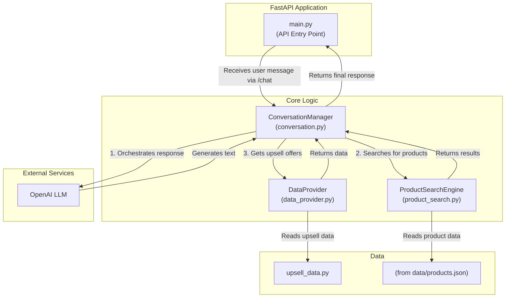

# Backend Source (`src`)

This directory contains the core backend logic for the Conversational Sales Assistant. It's a FastAPI application responsible for handling chat interactions, managing conversation state, and searching for products.

## Key Modules

-   **`main.py`**: The main entry point for the FastAPI application. It defines the API endpoints, handles application startup and shutdown events, and integrates all other modules.

-   **`conversation.py`**: The heart of the conversational logic. It manages the conversation state machine, orchestrates the interaction with the OpenAI language model, and handles the multi-step upsell journey.

-   **`product_search.py`**: Implements the product search functionality. It uses OpenAI's embeddings to perform semantic searches on the product data, allowing the assistant to find relevant products based on the user's conversational input.

-   **`scraper.py`**: Contains the `VodafoneDataScraper` class, which is responsible for scraping product information from the Vodafone UK website. This module uses Playwright to handle dynamic web content.

-   **`upsell_data.py`**: Stores the data for the upsell products (insurance, accessories, etc.). This is currently a simple in-memory data store but could be replaced with a database or external API.

-   **`data_provider.py`**: A simple data provider that simulates fetching upsell data. It's designed to be easily replaceable with a more robust data source.

-   **`models.py`**: Defines the Pydantic data models used for API request and response validation, such as `ChatRequest` and `ChatResponse`.

-   **`logging_config.py`**: Configures the application's logging, ensuring that all important events are recorded for debugging and analysis.

## Architecture

The backend is built with a decoupled architecture in mind. The `ConversationManager` in `conversation.py` is the central orchestrator, using the `ProductSearchEngine` for product lookups and the `data_provider` for upsell information. This separation of concerns makes the system easier to maintain and extend.

## Architecture Diagram

